# BLAST species identification from positive MAG pipeline contigs

This repository contains Copilot-generated Bash scripts for analyzing NCBI genomes and metagenomes to detect proteins matching a user-provided HMM profile.

The first script, `hmmsearch_metagenome_pipeline.sh`, can analyze genomes or metagenomes from a BioProject, a list of SRA IDs, or WGS master accessions. When necessary, (meta)SPAdes is used to assemble reads before downstream analysis. The second script,`blast_positive_contigs_remote.sh`, then extracts contigs with positive HMM hits and runs BLASTN on them to identify the most likely reference sequence or species.


## Table of contents

- [Installation](#installation)
- [Script 1: (meta)genome searches with an hmm profile](#script-1-metagenome-searches-with-an-hmm-profile)
  - [Common options](#common-options)
  - [WGS options](#wgs-mode-options)
  - [Bioproject/SRA options](#bioproject--sra-mode-options)
  - [Main results files](#main-result-files)
- [Script 2: Identify positive contigs by remote BLASTN](#script-2-identify-positive-contigs-by-remote-blastn)
  - [Outputs](#outputs)


The flowchart below details all the steps in both scripts.

```mermaid
flowchart TD
    SCRIPT1[[Script 1:<br/>hmmsearch_metagenome_pipeline.sh]]--> B[Parse command-line arguments]
    B --> C{Initial validation}
    C -->|Missing mode or HMM profile| CERR[Print error and exit]
    C -->|OK| D[Create output directories]
    D --> E[Initialize logs<br/>pipeline.log + per-sample logs]
    E --> F[Check required dependencies]
    F --> G{Execution mode}

    %% WGS branch
    G -->|WGS mode| W1[Read WGS/TSA master IDs<br/>from TSV/CSV file]
    W1 --> W2[Run WGS queue in parallel]
    W2 --> W3[For each master ID:<br/>resolve WGS/TSA token]
    W3 --> W4[Download nucleotide FASTA<br/>from NCBI FTP]
    W4 --> W5[Normalize FASTA headers]
    W5 --> W6[Run Prodigal<br/>protein prediction]
    W6 --> W7[Run hmmsearch<br/>against HMM profile]
    W7 --> W8{HMM hits found?}
    W8 -->|Yes| W9[Write partial hits file<br/>and summary status OK]
    W8 -->|No or failure| W10[Write summary status<br/>and clean negative outputs if needed]

    %% SRA source selection
    G -->|SRA mode| S0{SRA input source}
    S0 -->|BioProject| S1[Retrieve SRR runs<br/>from BioProject<br/>using esearch/efetch]
    S0 -->|TXT list| L1[Read SRA IDs from TXT file<br/>--sra-list sra_ids.txt]
    L1 --> L2[Clean and validate IDs<br/>ignore blanks/comments<br/>accept SRR/ERR/DRR]
    L2 --> L3[Remove duplicated IDs<br/>sort -u]
    S1 --> S2[Apply --max-runs<br/>if requested]
    L3 --> S2

    %% SRA processing branch
    S2 --> S3[Run SRA queue in parallel]
    S3 --> S4[For each SRR/ERR/DRR:<br/>run prefetch]
    S4 --> S5[Run fasterq-dump]
    S5 --> S6[Detect read layout:<br/>paired-end or single-end]
    S6 --> S7[Run SPAdes / metaSPAdes]
    S7 --> S8{SPAdes failed<br/>or no valid contigs?}

    S8 -->|Yes| S9[Write summary status:<br/>SPADES_FAIL or ASSEMBLY_FAIL]
    S9 --> S10[Copy native SPAdes log<br/>to logs/ID.spades.log<br/>if available]
    S10 --> S11[Remove intermediate files:<br/>prefetch, reads, assembly,<br/>nt, aa, gbk, tblout]
    S11 --> M[Merge outputs]

    S8 -->|No| S12[Copy contigs.fasta<br/>to nt/ID.contigs.fna]
    S12 --> S13[Run Prodigal<br/>protein prediction]
    S13 --> S14[Run hmmsearch<br/>against HMM profile]
    S14 --> S15{HMM hits found?}
    S15 -->|Yes| S16[Write partial hits file<br/>and summary status OK]
    S15 -->|No| S17[Write summary status NO_HITS<br/>and clean outputs according to options]

    %% Merge first script outputs
    W9 --> M
    W10 --> M
    S16 --> M
    S17 --> M
    M --> R1[(Results folder from Script 1<br/>results_pipeline/)]
    R1 --> R2[hits.tsv<br/>summary.tsv<br/>nt/*.fna<br/>logs/*.log]

    %% Second script
    R2 --> SCRIPT2[[Script 2:<br/>blast_positive_contigs_remote.sh]]
    SCRIPT2 --> B1[Read results folder<br/>-i results_pipeline]
    B1 --> B2[Read positive contigs<br/>from hits.tsv]
    B2 --> B3[Extract matching contig sequences<br/>from nt/*.fna]
    B3 --> B4[Write positive_contigs.fna<br/>and contig_map.tsv]
    B4 --> B5[Run blastn --remote<br/>for each positive contig]
    B5 --> B6[Save one BLAST output per contig<br/>outfmt 7<br/>blast7/contig.blast7]
    B6 --> B7[Parse each BLAST outfmt 7 file]
    B7 --> B8[Select top hit per contig]
    B8 --> B9[Add source_id column<br/>SRA/sample/WGS origin]
    B9 --> R3[(BLAST results folder<br/>blast_species/)]
    R3 --> R4[blast_top_hits.tsv<br/>positive_contigs.fna<br/>contig_map.tsv<br/>blast7/*.blast7<br/>logs/blast_species.log]


    %% Color scheme
    classDef startEnd fill:#1f4e79,color:#ffffff,stroke:#17365d,stroke-width:2px;
    classDef script fill:#7030a0,color:#ffffff,stroke:#4f1f73,stroke-width:2px;
    classDef setup fill:#d9eaf7,color:#000000,stroke:#5b9bd5,stroke-width:1.5px;
    classDef decision fill:#fff2cc,color:#000000,stroke:#d6b656,stroke-width:1.5px;
    classDef wgs fill:#e2f0d9,color:#000000,stroke:#70ad47,stroke-width:1.5px;
    classDef sraSource fill:#e4dfec,color:#000000,stroke:#8064a2,stroke-width:1.5px;
    classDef sraProcess fill:#fce4d6,color:#000000,stroke:#ed7d31,stroke-width:1.5px;
    classDef error fill:#f4cccc,color:#000000,stroke:#cc0000,stroke-width:1.5px;
    classDef output fill:#d9ead3,color:#000000,stroke:#38761d,stroke-width:1.5px;
    classDef blast fill:#ddebf7,color:#000000,stroke:#2f75b5,stroke-width:1.5px;
    classDef blastOutput fill:#d9ead3,color:#000000,stroke:#38761d,stroke-width:2px;

    class A,P startEnd;
    class SCRIPT1,SCRIPT2 script;
    class B,D,E,F setup;
    class C,G,W8,S0,S8,S15 decision;
    class W1,W2,W3,W4,W5,W6,W7,W9,W10 wgs;
    class S1,L1,L2,L3,S2 sraSource;
    class S3,S4,S5,S6,S7,S12,S13,S14 sraProcess;
    class CERR,S9,S10,S11 error;
    class M,R1,R2 output;
    class B1,B2,B3,B4,B5,B6,B7,B8,B9 blast;
    class R3 blastOutput;
```



## Installation

To ensure that all dependencies are available and compatible, we recommend creating a dedicated Conda environment using the provided YAML file:

```bash

git clone https://github.com/mredrejo/hmmsearch_metagenome.git
cd hmmsearch_metagenome

conda env create -f environment_bioconda.yml
conda activate bioconda

chmod +x *.sh
```

## Script 1: (meta)genome searches with an *hmm* profile
### Common options

| Option                  | Description                                                                                                                                                                                         |
| ----------------------- | --------------------------------------------------------------------------------------------------------------------------------------------------------------------------------------------------- |
| `--wgs`                 | Run the pipeline in WGS/TSA mode. Use this option when the input consists of WGS or TSA master accessions provided in a TSV/CSV file.                                                               |
| `--bioproject PRJNA...` | Run the pipeline in SRA mode using all SRA runs associated with a BioProject. The script retrieves the SRA run IDs automatically using NCBI Entrez Direct tools.                                    |
| `--sra-list FILE`       | Run the pipeline in SRA mode using a user-provided text file with SRA run IDs. The file may contain `SRR`, `ERR`, or `DRR` accessions. Empty lines and comment lines starting with `#` are ignored. |
| `-p, --profile FILE`    | Path to the HMM profile used for the search. This option is required.                                                                                                                               |
| `-o, --outdir DIR`      | Output directory. Default: `results_pipeline`.                                                                                                                                                      |
| `--evalue VALUE`        | Sequence-level E-value threshold for `hmmsearch`. Default: `1e-5`.                                                                                                                                  |
| `--cpu N`               | Number of CPUs used by `hmmsearch`. Default: `4`.                                                                                                                                                   |
| `--jobs N`              | Default number of parallel jobs. Default: `2`.                                                                                                                                                      |
| `--tmpdir DIR`          | Directory used for temporary files. By default, the script uses `OUTDIR/tmp`.                                                                                                                       |
| `-h, --help`            | Show the help message and exit.                                                                                                                                                                     |
### WGS mode options
| Option              | Description                                                                                                                                                            |
| ------------------- | ---------------------------------------------------------------------------------------------------------------------------------------------------------------------- |
| `-i, --input FILE`  | Input TSV or CSV file containing WGS/TSA master accessions. This option is required in `--wgs` mode.                                                                   |
| `--col N`           | Column number containing the WGS/TSA master accession in the input file. Default: `1`.                                                                                 |
| `--jobs-wgs N`      | Number of parallel jobs used in WGS mode. If this option is not specified, the value of `--jobs` is used.                                                              |
| `--keep-negatives`  | Keep nucleotide, protein, and HMM output files for WGS datasets with no positive hits. By default, files from negative WGS datasets may be removed to save disk space. |
| `--wgs-max-parts N` | Maximum number of WGS parts to check for each WGS/TSA master accession. Default: `200`.                                                                                |

### Bioproject / SRA mode options
| Option                                | Description                                                                                                                                                      |
| ------------------------------------- | ---------------------------------------------------------------------------------------------------------------------------------------------------------------- |
| `--max-runs N`                        | Limit the number of SRA runs to process. Default: `0`. A value of `0` means that all detected or provided runs are processed.                                    |
| `--jobs-sra N`                        | Number of parallel jobs used in SRA mode. If this option is not specified, the value of `--jobs` is used.                                                        |
| `--sra-threads N`                     | Number of threads used by `fasterq-dump`. Default: `6`.                                                                                                          |
| `--assembler metaspades\|spades_meta` | Assembler used for SRA read assembly. Default: `metaspades`. Available values: `metaspades` and `spades_meta`.                                                   |
| `--spades-threads N`                  | Number of threads used by SPAdes/metaSPAdes for each SRA run. Default: `8`.                                                                                      |
| `--spades-memory GB`                  | Maximum memory, in GB, used by SPAdes/metaSPAdes for each SRA run. Default: `32`.                                                                                |
| `--keep-assembly`                     | Keep SPAdes/metaSPAdes assembly folders, including assemblies from samples without positive hits. By default, some assemblies may be removed to save disk space. |
| `--keep-reads`                        | Keep FASTQ files generated by `fasterq-dump`. By default, reads are removed after processing to save disk space.                                                 |
## Examples
### Example with a BioProject
```bash
./hmmsearch_metagenome_pipeline.sh \
  --bioproject PRJNAxxxxxx \
  -p profile.hmm \
  -o results_pipeline
```

### Example with a TXT list of SRA IDs
Create a file called `sra_ids.txt` with one SRA run ID per line:

```text
SRR1234567
SRR1234568
ERR987654
DRR111111
```

Then run:

```bash
./hmmsearch_metagenome_pipeline.sh \
  --sra-list sra_ids.txt \
  -p profile.hmm \
  -o results_pipeline
```

### Example with WGS master IDs
Create a TSV file with one WGS/TSA master accession per line, for example `wgs_masters.tsv`:

```text
JABCDX000000000
JABCDY000000000
JABCDZ000000000
```

Then run the pipeline in `--wgs` mode:

```bash
./hmmsearch_metagenome_pipeline.sh \
  --wgs \
  -i wgs_masters.tsv \
  --col 1 \
  -p profile.hmm \
  -o results_pipeline_wgs \
  --jobs-wgs 4
```

If the WGS/TSA accession is not in the first column, change `--col 1` to the column number that contains the master accession.

### Main result files
#### `hits.tsv`

This is the main table containing all positive HMM hits detected by the pipeline.

Each row corresponds to a protein sequence matching the input HMM profile. The table includes information such as:

- contig ID
- predicted protein ID
- HMM query/profile name
- sequence-level E-value
- sequence score
- additional HMMER-derived information

This file is the main input used by the second script, `blast_positive_contigs_remote.sh`, to identify which contigs should be extracted and analyzed by remote BLASTN.

#### `summary.tsv`

This file provides one summary line per analyzed genome, metagenome, SRA run, or WGS dataset.

It reports the final status of each input item, the number of detected hits, and the best HMMER hit statistics when available.

### Sequence output folders
#### `nt/`
This folder contains nucleotide FASTA files.

For SRA-based analyses, this usually includes assembled contigs such as:
```
SRRxxxx.contigs.fna  
ERRxxxx.contigs.fna  
DRRxxxx.contigs.fna  
```

For WGS-based analyses, this folder contains downloaded nucleotide FASTA files derived from the corresponding WGS/TSA master accessions.

These nucleotide FASTA files are used by the second script to extract contigs with positive HMM hits.

#### `aa/`
This folder contains protein FASTA files predicted by Prodigal.

For example:
```
SRRxxxx.contigs.faa  
```

These files contain the predicted proteins that are searched against the input HMM profile.
#### `hmm/`

This folder contains raw HMMER output files, usually in `--tblout` format.

For example:

```
SRRxxxx.tblout  
```
These files are parsed by the pipeline to identify positive HMM hits and generate `hits.tsv` and `summary.tsv`

#### `logs/`
This folder contains log files generated during the analysis.

Common files include:
```
pipeline.log  
SRRxxxx.sra.log  
SRRxxxx.spades.log  
```

The file `pipeline.log` is the general execution log for the full pipeline.

Per-sample logs such as `SRRxxxx.sra.log`contain the command output for individual SRA runs.

If SPAdes/metaSPAdes fails and a native SPAdes log is available, it is copied to `SRRxxxx.spades.log`

### Intermediate folders
#### `parts/`
This folder contains temporary partial result files generated for each sample or dataset before the final merge step.

For example:
```
summary.SRRxxxx.tsv  
hits.SRRxxxx.tsv  
```

At the end of the pipeline, these partial files are merged into the final:
```
summary.tsv  
hits.tsv  
```
#### `tmp/`
This folder contains temporary files used during processing.

For SRA analyses, this may include intermediate `prefetch` folders.

Most temporary files are removed automatically unless required for debugging or if the pipeline stops unexpectedly.
#### `reads/`

This folder contains FASTQ files generated by `fasterq-dump` when running in SRA mode.

By default, reads are removed after processing to save disk space.
To keep the reads, use `--keep-reads`

#### `assembly/`
This folder contains SPAdes/metaSPAdes assembly directories when running in SRA mode.

For example: `assembly/SRRxxxx/`

For successful positive samples, this folder may contain SPAdes output files, including:
```
contigs.fasta  
spades.log  
```

For samples with no hits, assemblies may be removed unless `--keep-assembly` is used.

### Cleaning behavior
The pipeline automatically removes some intermediate files to reduce disk usage.
To keep additional intermediate files, use:

```
--keep-reads  
--keep-assembly  
--keep-negatives  
```


## Script 2: Identify positive contigs by remote BLASTN

After running the pipeline, use the BLAST script on the corresponding results folder.

### BLAST example for BioProject or SRA-list results

```bash
./blast_positive_contigs_remote.sh \
  -i results_pipeline \
  -o blast_species \
  --db nt \
  --max-target-seqs 10 \
  --evalue 1e-20 \
  --sleep 5
```

### BLAST example for WGS results

```bash
./blast_positive_contigs_remote.sh \
  -i results_pipeline_wgs \
  -o blast_species_wgs \
  --db nt \
  --max-target-seqs 10 \
  --evalue 1e-20 \
  --sleep 5 \
  --resume
```
#### Notes

- `blastn --remote` requires internet access.
- Remote BLAST can be slow when many contigs are positive.
- Use `--resume` to avoid repeating BLAST searches that already have a non-empty `.blast7` file.
- Use `--sleep` to add a pause between remote BLAST requests.

## Outputs

The BLAST script creates:

```text
blast_species/positive_contigs.fna
blast_species/contig_map.tsv
blast_species/blast7/<contig>.blast7
blast_species/blast_top_hits.tsv
blast_species/logs/blast_species.log
```

For WGS mode, replace `blast_species/` with the output directory used in the BLAST command, for example `blast_species_wgs/`.

The final summary file `blast_top_hits.tsv` contains the top BLAST hit for each positive contig and a `source_id` column indicating the SRA/sample/WGS ID inferred from the original pipeline results.

