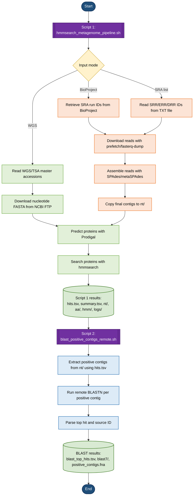

# HMM search in NCBI genomes and metagenomes

This repository contains Copilot-generated Bash scripts for analyzing NCBI genomes and metagenomes to detect proteins matching a user-provided HMM profile.

The first script, `hmmsearch_metagenome_pipeline.sh`, can analyze genomes or metagenomes from a BioProject, a list of SRA IDs, or WGS/TSA master accessions. When necessary, (meta)SPAdes is used to assemble SRA reads before downstream analysis.

The second script, `blast_positive_contigs_remote.sh`, extracts contigs with positive HMM hits and runs remote BLASTN searches to identify the most likely reference sequence or species.

## Table of contents

- [Installation](#installation)
- [Workflow](#workflow)
- [Script 1: HMM search pipeline](#script-1-hmm-search-pipeline)
  - [Script 1 examples](#script-1-examples)
  - [Script 1 command-line options](#script-1-command-line-options)
  - [Script 1 output structure](#script-1-output-structure)
- [Script 2: Remote BLASTN of positive contigs](#script-2-remote-blastn-of-positive-contigs)
  - [Script 2 examples](#script-2-examples)
  - [Script 2 command-line options](#script-2-command-line-options)
  - [Script 2 output structure](#script-2-output-structure)
- [Notes on cleaning, resume behavior, and disk usage](#notes-on-cleaning-resume-behavior-and-disk-usage)

## Installation

Clone the repository and create the Conda environment using the provided YAML file:

```bash
git clone https://github.com/mredrejo/hmmsearch_metagenome.git
cd hmmsearch_metagenome

conda env create -f environment_bioconda.yml
conda activate bioconda

chmod +x *.sh
```

##  Workflow



## Script 1: HMM search pipeline

The main pipeline script is:

```bash
./hmmsearch_metagenome_pipeline.sh
```

It searches NCBI genomes or metagenomes for proteins matching a user-provided HMM profile.

One input mode must be selected:

- `--wgs`
- `--bioproject`
- `--sra-list`

By default, the script does not repeat IDs that already have a completed partial summary file in `parts/`. Use `--force` to reprocess all IDs and regenerate previous partial and final results.

### Script 1 examples

#### BioProject mode

```bash
./hmmsearch_metagenome_pipeline.sh \
  --bioproject PRJNAxxxxxx \
  -p profile.hmm \
  -o results_pipeline
```

#### SRA-list mode

Create a file called `sra_ids.txt` with one SRA run ID per line:

```text
SRR1234567
SRR1234568
ERR987654
DRR111111
```

Then run:

```bash
./hmmsearch_metagenome_pipeline.sh \
  --sra-list sra_ids.txt \
  -p profile.hmm \
  -o results_pipeline
```

#### WGS mode

Create a TSV file with one WGS/TSA master accession per line, for example `wgs_masters.tsv`:

```text
JABCDX000000000
JABCDY000000000
JABCDZ000000000
```

Then run:

```bash
./hmmsearch_metagenome_pipeline.sh \
  --wgs \
  -i wgs_masters.tsv \
  --col 1 \
  -p profile.hmm \
  -o results_pipeline_wgs \
  --jobs-wgs 2 \
  --ncbi-sleep 1 \
  --ncbi-retries 8
```

If the WGS/TSA accession is not in the first column, change `--col 1` to the appropriate column number.

### Script 1 command-line options

#### Input mode options

| Option | Description |
|---|---|
| `--wgs` | Run the pipeline in WGS/TSA mode. The input must be a TSV/CSV file containing WGS/TSA master accessions. |
| `--bioproject PRJNA...` | Run the pipeline in SRA mode using all SRA runs associated with a BioProject. SRA run IDs are retrieved automatically using NCBI Entrez Direct tools. |
| `--sra-list FILE` | Run the pipeline in SRA mode using a user-provided TXT file with SRA run IDs. The file may contain `SRR`, `ERR`, or `DRR` accessions. Empty lines and lines starting with `#` are ignored. |

#### Common options

| Option | Description |
|---|---|
| `-p, --profile FILE` | Path to the HMM profile used for the search. This option is required. |
| `-o, --outdir DIR` | Output directory. Default: `results_pipeline`. |
| `--evalue VALUE` | Sequence-level E-value threshold for `hmmsearch`. Default: `1e-5`. |
| `--cpu N` | Number of CPUs used by `hmmsearch`. Default: `4`. |
| `--jobs N` | Default number of parallel jobs. Default: `2`. |
| `--force` | Reprocess all IDs, overwrite previous partial results, and regenerate final `hits.tsv` and `summary.tsv`. Without this option, completed IDs are skipped by default. |
| `--tmpdir DIR` | Directory used for temporary files. By default, the script uses `OUTDIR/tmp`. |
| `-h, --help` | Show the help message and exit. |

#### NCBI / E-utilities options

These options are mainly relevant in WGS mode, where the script queries NCBI E-utilities to resolve WGS/TSA master accessions.

| Option | Description |
|---|---|
| `--ncbi-api-key KEY` | NCBI API key used by EDirect/E-utilities. This can help reduce `HTTP 429 Too Many Requests` errors. The key is exported as `NCBI_API_KEY` but is not printed in the logs. |
| `--ncbi-sleep SEC` | Minimum global pause between E-utilities calls. Default: `1`. Increase this value if NCBI returns `429 Too Many Requests`. |
| `--ncbi-retries N` | Number of retries for failed E-utilities calls. Default: `5`. |

#### WGS mode options

These options are used with `--wgs`.

| Option | Description |
|---|---|
| `-i, --input FILE` | Input TSV or CSV file containing WGS/TSA master accessions. This option is required in `--wgs` mode. |
| `--col N` | Column number containing the WGS/TSA master accession in the input file. Default: `1`. |
| `--jobs-wgs N` | Number of parallel jobs used in WGS mode. If not specified, the value of `--jobs` is used. Low values are recommended to avoid excessive NCBI requests. |
| `--keep-negatives` | Keep nucleotide, protein, and HMM output files for WGS datasets with no positive hits. By default, files from negative WGS datasets may be removed to save disk space. |
| `--wgs-max-parts N` | Maximum number of WGS parts to check for each WGS/TSA master accession. Default: `200`. |

#### BioProject / SRA mode options

These options are used with `--bioproject` or `--sra-list`.

| Option | Description |
|---|---|
| `--max-runs N` | Limit the number of SRA runs to process. Default: `0`. A value of `0` means that all detected or provided runs are processed. |
| `--jobs-sra N` | Number of parallel jobs used in SRA mode. If not specified, the value of `--jobs` is used. |
| `--sra-threads N` | Number of threads used by `fasterq-dump`. Default: `6`. |
| `--assembler metaspades\|spades_meta` | Assembler used for SRA read assembly. Default: `metaspades`. Available values are `metaspades` and `spades_meta`. |
| `--spades-threads N` | Number of threads used by SPAdes/metaSPAdes for each SRA run. Default: `8`. |
| `--spades-memory GB` | Maximum memory, in GB, used by SPAdes/metaSPAdes for each SRA run. Default: `32`. |
| `--keep-assembly` | Keep SPAdes/metaSPAdes assembly folders. By default, `assembly/<ID>/` is deleted after `contigs.fasta` has been copied to `nt/<ID>.contigs.fna`. |
| `--keep-reads` | Keep FASTQ files generated by `fasterq-dump`. By default, reads are removed after processing to save disk space. |

### Script 1 output structure

The output directory is specified with `-o/--outdir`.

In WGS mode, the script creates only the folders required for WGS analysis:

```text
results_pipeline_wgs/
├── hits.tsv
├── summary.tsv
├── nt/
├── aa/
├── hmm/
├── logs/
├── parts/
└── tmp/
```

In BioProject/SRA mode, the script also creates `reads/` and `assembly/`:

```text
results_pipeline/
├── hits.tsv
├── summary.tsv
├── nt/
├── aa/
├── hmm/
├── logs/
├── parts/
├── tmp/
├── reads/
└── assembly/
```

By default, `reads/` and per-sample `assembly/<ID>/` folders are cleaned to reduce disk usage.

#### Main result files

##### `hits.tsv`

Main table containing all positive HMM hits detected by the pipeline. Each row corresponds to a predicted protein matching the input HMM profile. This file is used by the second script to identify which contigs should be extracted and analyzed by BLASTN.

##### `summary.tsv`

Summary table with one line per analyzed genome, metagenome, SRA run, or WGS dataset. It reports the final status, the number of detected hits, and the best HMMER hit statistics when available.

Typical status values include:

```text
OK
NO_HITS
PREFETCH_FAIL
FASTQ_DUMP_FAIL
READS_FAIL
SPADES_FAIL
ASSEMBLY_FAIL
PRODIGAL_FAIL
HMMSEARCH_FAIL
WGS_TOKEN_FAIL
WGS_CODE_FAIL
WGS_DOWNLOAD_FAIL
```

#### Main output folders

##### `nt/`

Contains nucleotide FASTA files.

For SRA-based analyses, this usually includes assembled contigs:

```text
SRRxxxx.contigs.fna
ERRxxxx.contigs.fna
DRRxxxx.contigs.fna
```

For WGS-based analyses, this folder contains downloaded nucleotide FASTA files derived from WGS/TSA master accessions.

##### `aa/`

Contains protein FASTA files predicted by Prodigal.

##### `hmm/`

Contains raw HMMER output files, usually in `--tblout` format.

##### `logs/`

Contains execution logs, including:

```text
pipeline.log
<ID>.wgs.log
<ID>.sra.log
<ID>.spades.log
```

If SPAdes/metaSPAdes fails and a native SPAdes log is available, the log is copied to `logs/<ID>.spades.log` before intermediate files are removed.

##### `parts/`

Contains partial per-ID result files before they are merged into the final `hits.tsv` and `summary.tsv`.

##### `tmp/`

Contains temporary files used during processing.

##### `reads/`

Contains FASTQ files generated by `fasterq-dump` in SRA mode. By default, reads are removed after processing unless `--keep-reads` is used.

##### `assembly/`

Contains SPAdes/metaSPAdes assembly folders in SRA mode. By default, each `assembly/<ID>/` folder is removed after `contigs.fasta` has been copied to `nt/<ID>.contigs.fna`. Use `--keep-assembly` to keep these folders.

## Script 2: Remote BLASTN of positive contigs

The BLAST script is:

```bash
./blast_positive_contigs_remote.sh
```

It uses the output of Script 1, extracts contigs with positive HMM hits, runs remote BLASTN, and summarizes the top hit for each contig.

### Script 2 examples

#### BLAST for BioProject or SRA-list results

```bash
./blast_positive_contigs_remote.sh \
  -i results_pipeline \
  -o blast_species \
  --db nt \
  --max-target-seqs 10 \
  --evalue 1e-20 \
  --sleep 5 \
  --resume
```

#### BLAST for WGS results

```bash
./blast_positive_contigs_remote.sh \
  -i results_pipeline_wgs \
  -o blast_species_wgs \
  --db nt \
  --max-target-seqs 10 \
  --evalue 1e-20 \
  --sleep 5 \
  --resume
```

### Script 2 command-line options

| Option | Description |
|---|---|
| `-i, --indir DIR` | Results directory generated by Script 1. This option is required. |
| `-o, --outdir DIR` | Output directory for BLAST results. Default: `blast_species`. |
| `--db DB` | Remote BLAST database. Default: `nt`. |
| `--entrez-query QUERY` | Optional Entrez filter for remote BLAST searches. |
| `--max-target-seqs N` | Maximum number of BLAST hits reported per contig. Default: `10`. |
| `--evalue VALUE` | E-value threshold for BLASTN. Default: `1e-20`. |
| `--word-size N` | Word size for BLASTN. Default: `28`. Lower values may improve sensitivity for short contigs. |
| `--perc-identity VALUE` | Optional minimum percent identity filter. If omitted, no percent identity filter is applied. |
| `--sleep SEC` | Pause between remote BLAST requests. Default: `5`. |
| `--resume` | Do not repeat BLAST searches for contigs that already have a non-empty `.blast7` output file. |
| `-h, --help` | Show the help message and exit. |

If using the parallel version of the BLAST script, these additional options are available:

| Option | Description |
|---|---|
| `--blast-jobs N` | Number of positive contigs analyzed in parallel with remote BLASTN. Default: `1`. Low values such as `2` or `3` are recommended for NCBI remote BLAST. |
| `--stagger SEC` | Initial delay between parallel BLAST jobs to avoid submitting all remote requests at exactly the same time. Default: `2`. |

### Script 2 output structure

The BLAST script creates:

```text
blast_species/
├── positive_contigs.fna
├── contig_map.tsv
├── blast_top_hits.tsv
├── blast7/
│   └── <contig>.blast7
├── logs/
│   └── blast_species.log
└── tmp/
```

If using the parallel BLAST script, per-contig job logs may also be created:

```text
blast_species/logs/blast_jobs/
```

#### Main BLAST output files

##### `positive_contigs.fna`

FASTA file containing all contigs with positive HMM hits.

##### `contig_map.tsv`

Mapping table linking each BLAST query ID to the original contig ID, source ID, source FASTA file, and contig length.

##### `blast7/<contig>.blast7`

Raw BLASTN output for each positive contig in `outfmt 7` format.

##### `blast_top_hits.tsv`

Final summary table containing the top BLAST hit for each positive contig. The table includes a `source_id` column indicating the SRA/sample/WGS origin inferred from the Script 1 results.

## Notes on cleaning, resume behavior, and disk usage

- Script 1 skips previously completed IDs by default if `parts/summary.<ID>.tsv` already exists and is non-empty.
- Use `--force` with Script 1 to reprocess all IDs and regenerate partial and final results.
- In SRA mode, reads are removed by default after processing. Use `--keep-reads` to keep them.
- In SRA mode, `assembly/<ID>/` is removed by default after `contigs.fasta` is copied to `nt/<ID>.contigs.fna`. Use `--keep-assembly` to keep SPAdes output folders.
- In WGS mode, folders such as `reads/` and `assembly/` are not created.
- Remote BLASTN requires internet access and can be slow for large numbers of positive contigs.
- Use `--resume` with Script 2 to avoid repeating BLAST searches that already have non-empty `.blast7` files.
